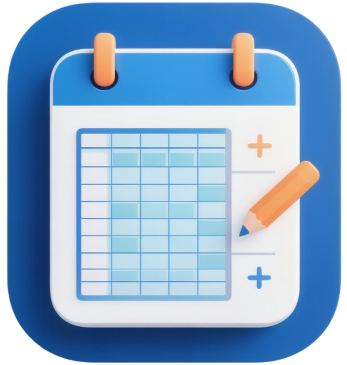
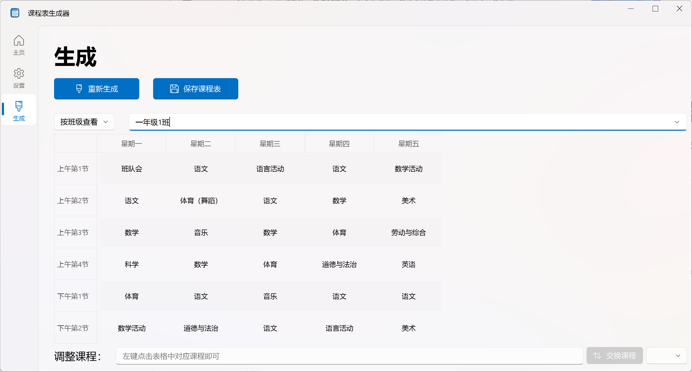
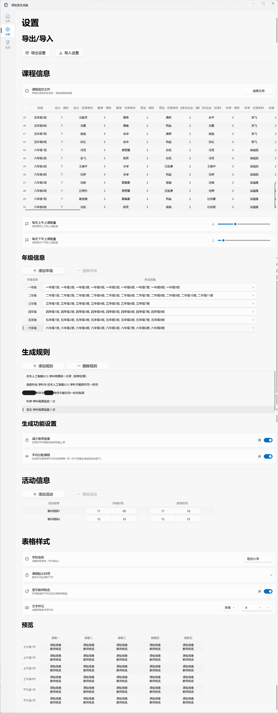

  

<h1 align="center">课程表生成器</h1>

  一个可以帮助中小学生成符合需求的课程表的小工具

## 项目介绍
排课是一件很麻烦的事情，但是使用这个小工具，你可以轻松地生成整个学校师生所需的课程表。

## 主要亮点
- 界面简洁易上手，几乎无学习成本
- 课程表生成规则支持自定义
- 功能人性化，如减少教师连堂、平均分配课程等

## 支持的设置选项

（图中信息为示例）
- **课程信息**：支持一键导入全校班级的学科课时及任课教师
- **生成规则**：支持自定义课程表生成规则
- **活动信息**：可以将校园活动显示在课程表上（如大课间、眼保健操等）
- **表格样式**：包括学校名称、显示教师姓名、文字样式，自定义课程起止时间

## 使用方法（二选一）
### 一、自行搭建运行环境
1. 前往[Python官网](https://python.org/downloads)下载并安装Python3.9+版本
2. 将本项目下载解压到本地
3. 在项目根目录运行`pip install -r requirements.txt`（报错可搜索“pip换源”）
4. 双击`main.py`或运行`python main.py`即可启动
### 二、使用[Releases](https://github.com/hengdapi/School-Timetable-Generater/releases)中的安装包
选择对应版本的安装包，双击安装即可
